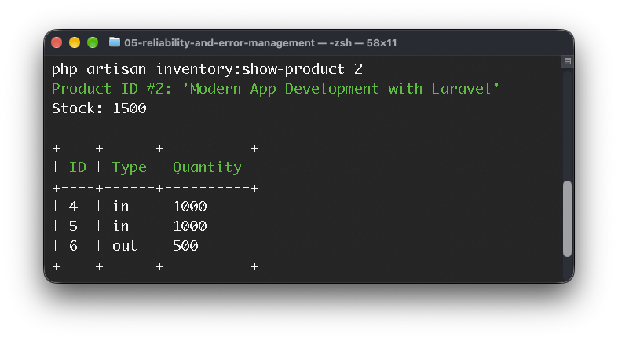

## Example Inventory Component

A simple Laravel project that demonstrates how to build an inventory component using Laravel's features.



The goal of this repository is not to build the best inventory application. Instead, it focuses on teaching how organize a Laravel application using a component architecture, where an entire feature lives in its own directory.

### Directory Structure

```
components
└── Inventory
    ├── Actions
    │   ├── CreateMovement.php
    │   └── CreateProduct.php
    ├── Commands
    │   ├── CreateMovementCommand.php
    │   ├── CreateProductCommand.php
    │   └── ShowProductCommand.php
    ├── Database
    │   └── Migrations
    │       ├── 2026_10_06_134545_create_products_table.php
    │       └── 2026_10_06_134717_create_movements_table.php
    ├── Enums
    │   └── MovementType.php
    ├── InventoryServiceProvider.php
    └── Models
        ├── Movement.php
        └── Product.php
```

Everything related to the inventory feature lives inside the `components/Inventory` directory. This includes the actions, commands, model, service provider, and migrations. This makes the code easier to understand, maintain, and eventually extract another project if needed.

### License

This project is open-sourced software licensed under the [MIT license](https://opensource.org/licenses/MIT).